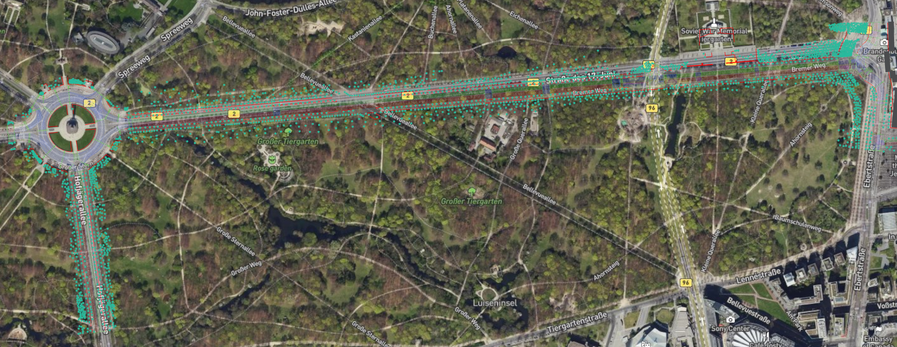

<p align="center">
  
</p>

# Berlin HD map sample — Str. des 17. Juni

Public sample assets for a high-definition road network along **Str. des 17. Juni** in Berlin (Urban Road / `DE_UR` naming), covering the stretch from the **Brandenburg Gate** (*Brandenburger Tor*) to the **Victory Column** (*Siegessäule*). The repository includes the **measurement drive data** and a high-fidelity **OpenDRIVE map**. The corresponding **Unreal Engine** scene will be available soon.

## Repository layout

| Path | Contents |
|------|----------|
| [`maps/opendrive/`](maps/opendrive/) | OpenDRIVE (`.xodr`) road network for the scene |
| [`drive-data/`](drive-data/) | Reserved for measurement / drive recordings |
| [`unreal-engine/`](unreal-engine/) | Unreal Engine project or export notes *(coming soon)* |

## How to download the full dataset
This repository uses **Git Large File Storage (Git LFS)** for large data files such as **JPEG camera images** and **LAZ point cloud tiles**. If Git LFS is not pulled correctly, these files may appear as small pointer files instead of usable images or point cloud data.
Install and initialize Git LFS:
```bash
git lfs install
```
Clone the repository:
```bash
git clone <repository-url>
cd <repository-folder>
```
Download the actual JPEG and LAZ files:
```bash
git lfs fetch --all
git lfs checkout
git lfs pull
```
The JPEG files are located in:
```text
drive-data/Berlin-Cut-5878-6708/JPEG/Berlin_JPEG
```
The LAZ point cloud tiles are located in:
```text
drive-data/Berlin-Cut-5878-6708/Tiles_Berlin-Cut-5878-6708
```
To verify the download, check the file size. If a JPEG or LAZ file is only around **100–200 bytes** and contains text similar to `version https://git-lfs.github.com/spec/v1`, it is still a Git LFS pointer file. Run the Git LFS commands again from the repository root:
```bash
git lfs fetch --all
git lfs checkout
git lfs pull
```
After this, the JPEG files should open normally as images, and the LAZ files should be usable as point cloud tiles.

## HD map

- **Coverage:** Str. des 17. Juni, Berlin — from the Brandenburg Gate to the Victory Column.  
- **File:** [`maps/opendrive/DE_UR_Berlin_StrDes17Juni_RR.xodr`](maps/opendrive/DE_UR_Berlin_StrDes17Juni_RR.xodr)  
- **Format:** [ASAM OpenDRIVE](https://www.asam.net/standards/detail/opendrive/) — suitable for simulation, validation, and tooling that consumes lane-level road geometry.  
- **Map details:** See [`maps/README.md`](maps/README.md) for geographic coverage, provenance, and a full list of what is modeled in the high-fidelity `.xodr`.

### Map preview

<p align="center">
  
  <br/>
  <em>OpenDRIVE map loaded in <a href="https://www.automotive-ai.com/replimap">RepliMap</a>, overlaid on Mapbox satellite imagery.</em>
</p>

## Drive data

Leica-style sensor package (trajectory CSV, camera JPEGs, LiDAR tiles as applicable). The drive data shared in this repository is **loadable in [RepliMap](https://www.automotive-ai.com/replimap)** for editing, visualization, and enrichment alongside the HD map.

### RepliMap

[**RepliMap**](https://www.automotive-ai.com/replimap) is a unified platform designed for HD map editing and 3D scene editing for autonomous driving, enabling engineers to create, customize, and enrich road networks with precision.

## Unreal Engine scene

A 3D environment built from this map and data is **planned**. Status and any export/import notes will be tracked in [`unreal-engine/README.md`](unreal-engine/README.md).

## License

Use of the map and any other materials in this repository is governed by **[`LICENSE`](LICENSE)** in the repository root: **no commercial use**, **no resale**, and **no reutilization** (e.g. incorporating the data into other products, services, or datasets) without written permission from the copyright holder(s). 
