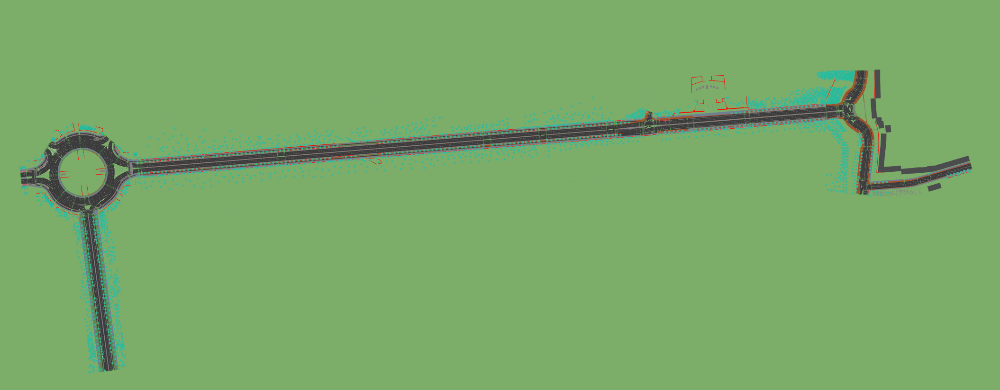

# Maps

- **`opendrive/`** — ASAM OpenDRIVE (`.xodr`) road networks for this sample.

## Geographic coverage

**Str. des 17. Juni**, Berlin, along the corridor from the **Brandenburg Gate** (*Brandenburger Tor*) to the **Victory Column** (*Siegessäule*).

## Map preview

  
   
  <em>OpenDRIVE (<code>.xodr</code>) map loaded in the <a href="https://www.automotive-ai.com/replimap">RepliMap</a> tool.</em>

## OpenDRIVE file

- **File:** [`opendrive/DE_UR_Berlin_StrDes17Juni_RR.xodr`](opendrive/DE_UR_Berlin_StrDes17Juni_RR.xodr)  
- **Version:** ASAM OpenDRIVE **v1.6**

This map is generated from measurement drive data collected with a **Leica** system. The road network, elevation, objects, and related attributes are derived from that drive data and editorial passes in HD mapping tooling.

## What the high-fidelity OpenDRIVE map includes

The `.xodr` is intended for simulation- and editor-ready use. It contains:

- **Road geometry** — centerline / plan-view geometry for the drivable network  
- **Elevation profile** — vertical alignment along roads (height / grade)  
- **Lane-level detail** — lane topology, widths, and related lane structure  
- **Lane markings** — longitudinal and lateral marking semantics in OpenDRIVE  
- **Lane materials** — surface / friction-style lane material assignments where modeled  
- **Lane priorities** — priority and ordering at merges and junction-related contexts  
- **Road marks** — road-mark records associated with lanes (types, placement)  
- **Lane heights** — inner/outer lane height offsets where specified (e.g. curb and cross-fall effects)  
- **Objects** — roadside and in-scene objects, including **required** infrastructure elements and **decorative** assets  
- **Signals** — traffic control and signage-related information aligned with **German regulatory standards** for road equipment and traffic rules  

For repository-wide context, see the root [`README.md`](../README.md).
